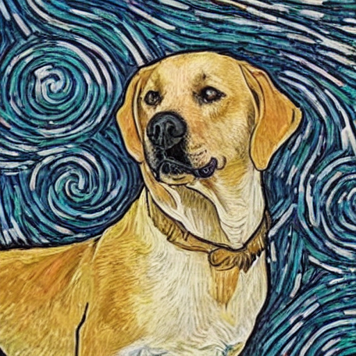
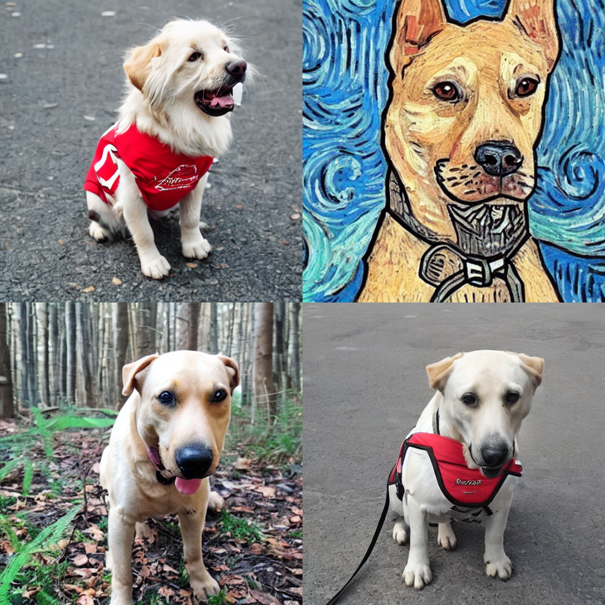
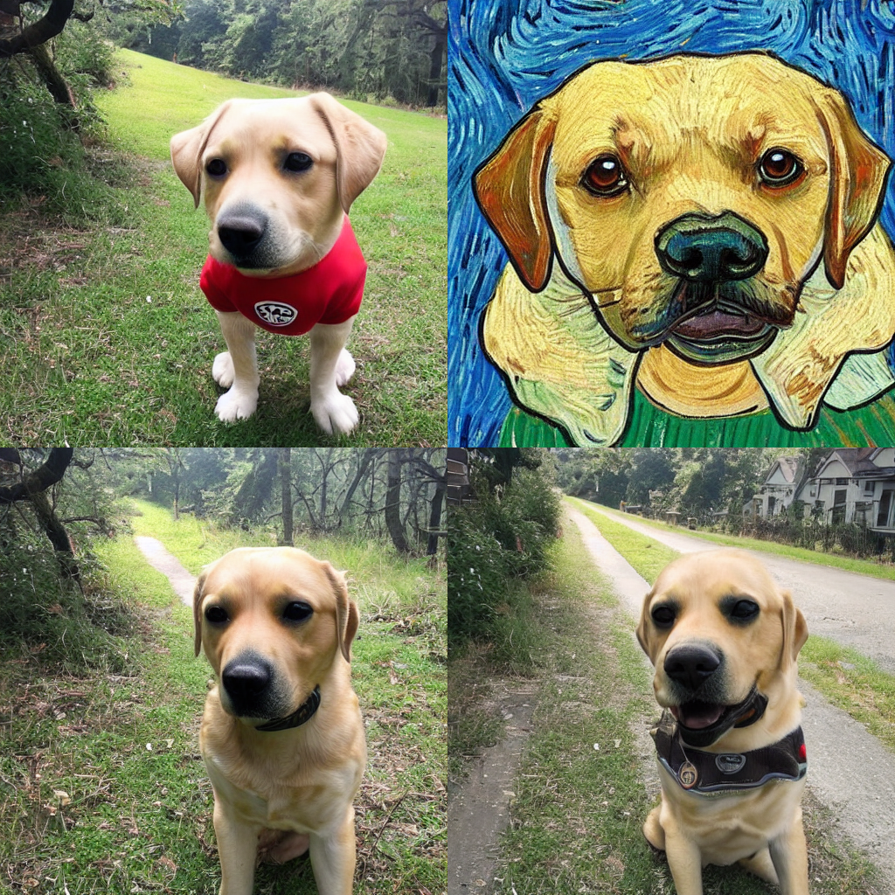
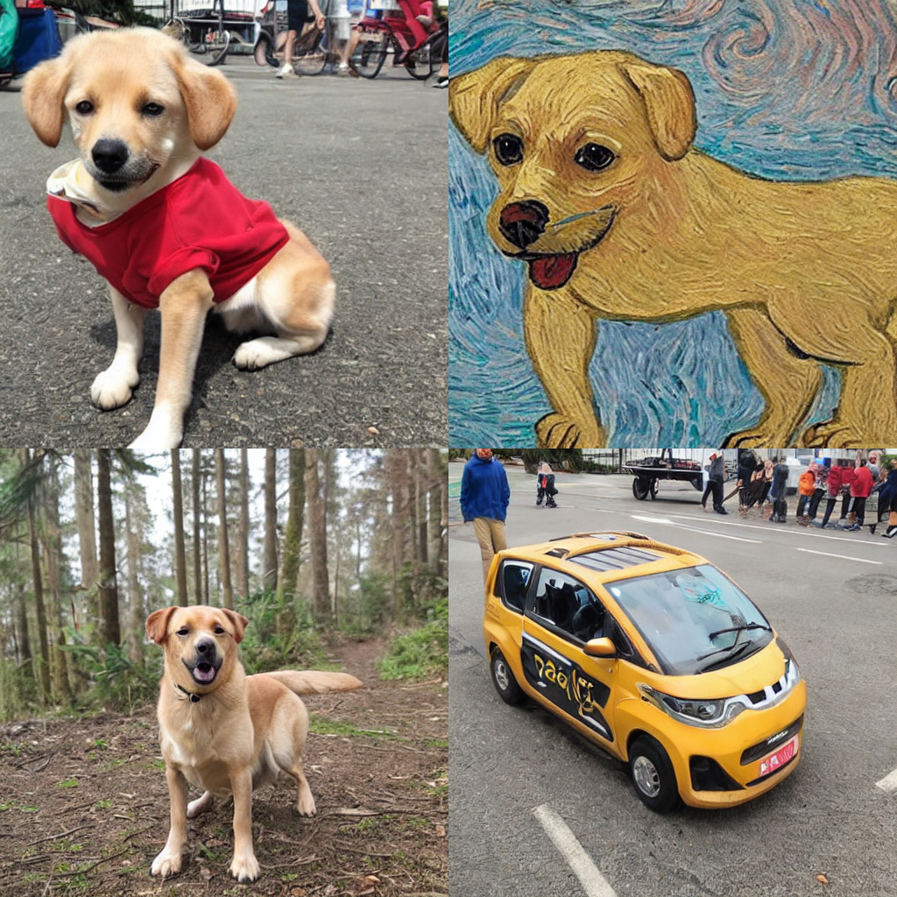
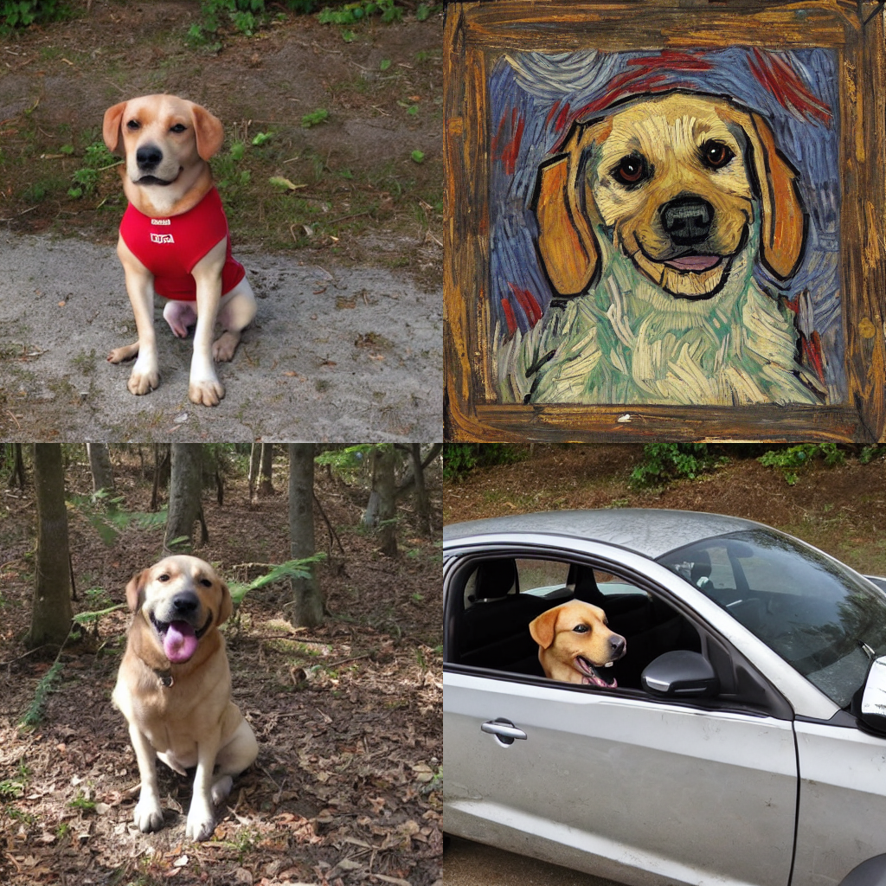
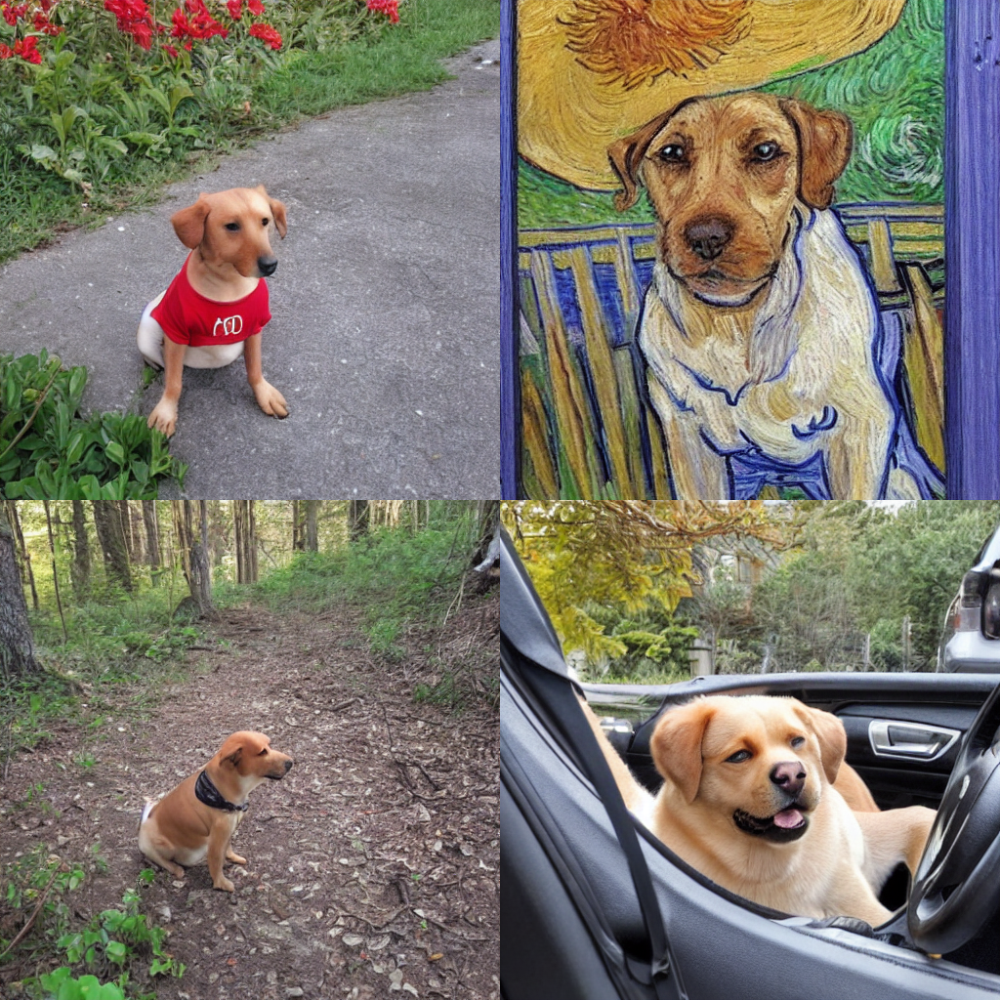
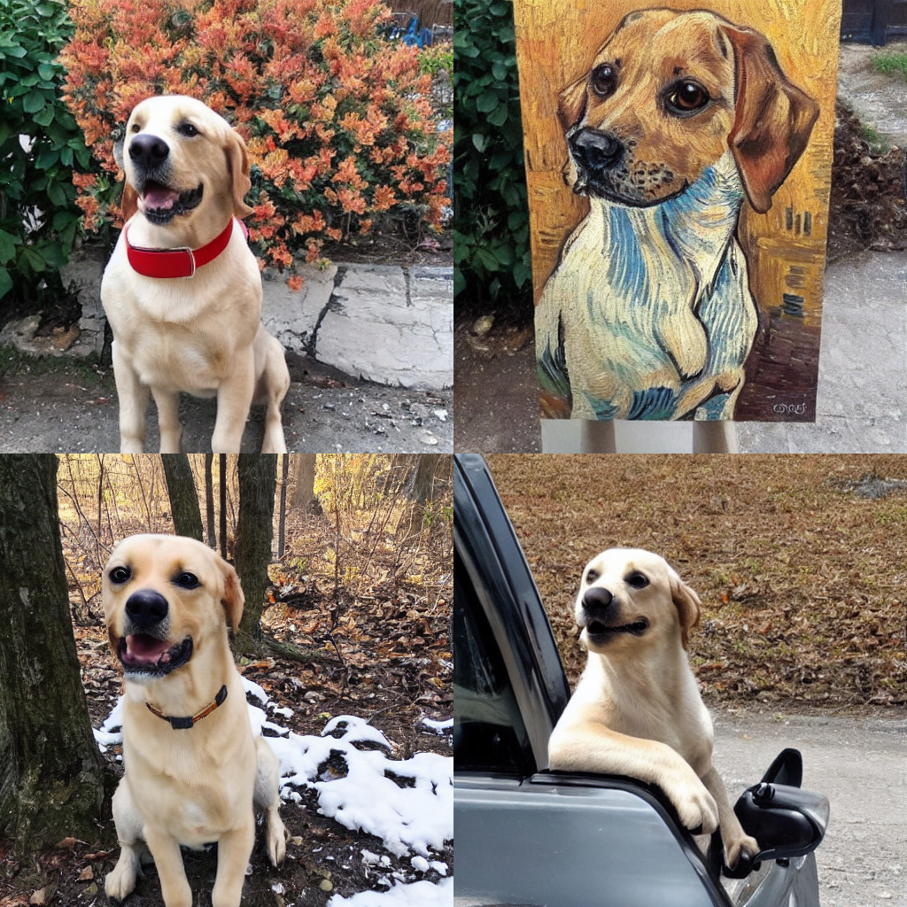

# dreamboth mydog genereted

 

 - [Описание статьи](#что-это-такое) 
    - [что это такое ?](#что-это-такое-)
    - [Почему над этим работают?](#почему-над-этим-работают)
    - [Как формулируется задача?](#как-формулируется-задача)
    - [В чем ее основная идея?](#в-чем-её-основная-идея)
    - [В чем ее новаторство?](#в-чем-ее-новаторство)
    - [Какие получились результаты?](#какие-получились-результаты)
 - {Обучение на картинках моей собаки}
    - результаты
    - сравнения
 - Guide
   - [quickstart](#quickstart)
   - [train](#train)
   - [interference](#interference)

## что это такое ?
 В [DreamBoth(paper)](https://arxiv.org/pdf/2208.12242.pdf "link")  предлагается метод дообучения дифузионных tex2img моделей на маленьком датасете (до 30 изображений одного класса, однотипного объекта) путем внедрения уникальных токенов, которые привязываются к классу. Это позволяет генерировать изображения с объектом из обучающей выборки в разных сценах, сохраняя важные детали объекта. Так, вы можете обучить дифузионную модель на изображениях своей любимой собачки и генерировать картинки, где ваша собака гуляет по парижу и пьёт капучино! 

 ## Почему над этим работают?
   Большие модели преобразования текста в изображение совершили значительный скачок в эволюции искусственного интеллекта, обеспечив высококачественный и разнообразный синтез изображений из заданной текстовой подсказки. Однако этим моделям не хватает способности имитировать внешний вид объектов в заданном наборе ссылок и синтезировать их новые представления в различных контекстах.
   
   Метод DreamBoth позволяет справляется с <b>language drift (языковой дрейф)</b> - это явление, при котором язык или его использование со временем меняется или сдвигается в своем значении, смысле или терминологии. Из-за чего даже тонко настроенные, когда-то хорошо работающие  tex2img  модели начинают работать некорректно. Чтобы решитью эту проблему в статье используют class-specific prior preservation-loss, который поощеряет разнообразие и противодествует языковому дрейфу.
   
   Также этот метод  решает задачу генерации объекта в различных сценах и позах, стилях не теряя при этом ключяевых особенностей объекта; Важно, что метод позволит инетгрировать объект в сцены, которых даже не было в обучающей выборке. Решение этой задачи может пригодится для генерации карточек товаров на онлайн-маркетах!
  
## Как формулируется задача?
Главная задача состоит в том, чтобы внедрить экземпляр объекта в область вывода модели таким образом, чтобы мы могли запрашивать у модели различные новые изображения объекта. Попутно с этим в результате решаются задачи переноса стиля, переноса изображения на новый фон, смешивание классов в одном объекте (можно сгенерироывть картинку вашей собаки в классе бегемота и получится бегемот с лицом собачки:) А также может решаться задача изменения качеств объекта - допустим замены цвета, материала из которого сделан объект в обучающей выборке. 

## В чем ее основная идея?
Основная идея метода это внедрить в описание объектов обучающей выборки(до 30 изображений) уникальный "редкий_токен", который будет обозначать объект на котором мы обучаемся. Редкий токен в описании связвается с названием класса, (например описание изображения из тренировочной выборки может выглядеть так: <Фото "редкий_токен" собаки>); Это позволяет использовать уже имеющиеся знания модели о классах и научить её новому объекту под названием "редкий_токен" связанным с каким либо классом. Именно знания о классе с которым связан "редкий_токен" позволит генерировать наш объект из обучающей выборки сохраняя его ключевые детали и изменяя сцены и позы в которых находится объект. 

Но не только внедрение "редкого_токена" помогает добиться хороших результатов. class-specific prior preservation-loss, который позволяет бороться с language drift и переобучением.

 

_**Замечание**: В статье не рекомендуют использовать в качастве редких токенов случайный набор букв, ведь это может привести к тому, что языковая модель разделит ваш уникальный токен(слово) на буквы(токены) и мы во время обучения будем связывать класс с несколькими буквами, а это не приводит к хорошим результатам. Рекомендуется использовать короткие, не случайные наборы букв._

## В чем ее новаторство?
В статье описывают технику для решения нескольких ранее невыполнимых задач, включая реконтекстуализацию объекта, синтез представлений с ориентацией на текст и художественную визуализацию, сохраняя при этом ключевые особенности объекта. Также предоставлян новый набор данных и протокол оценки для этой новой задачи предметно-ориентированного генерирования.

## Какие получились результаты?
В целом метод представленный в статье позволял генерировать объекты в разных с сценах и некоторые генерации были почти неотличимы от реальных фотографий, однако иногда могут возниковать проблемы. 

 

<b>А вот какие проблемы могут быть</b>: переобучение(с), синтезация некоректоного контекста(a), Контекст и внешний вид предмета могут перепутаться(b).

## Обучение на картинках моей собаки
<b>Постановка эксперимента: </b>
 - фиксируем train_step = 1300
 - фиксируем batch_size  = 1
 - фиксируем learning rate = 3e-4, 1e-4
 - train random seed = 42
 - LORA_SCALE_UNET = 0.4
 - LORA_SCALE_TEXT_ENCODER = 0.4
 - GUIDANCE = 6.4

Замечено, что выбор промта и редкого токена часто оказывают сильнейшее влияние на генерацию. Чтобы подобрать редкий токен было выбрано несколько идей из опыта интернет-комьюнити и все они протестированы (sks, http, hta, oue). Также эксперимент будет интересен тем, что я буду обучать используя простые фотографии своей собаки с телефона!

Сначала я обучал модель, потом делал 4 генерации "A {rare-token} dog" с разным random seed, а затем генерирвал 4 картинки тестовые для проверки возможностей c различным промтом:
 - смена одежды объекта: A {RARE_TOKEN} {CLASS} in red t-shorts.
 - смена стиля: A {RARE_TOKEN} {CLASS} in the style of van gogh.
 - сменя локации: A {RARE_TOKEN} {CLASS} in the forest.
 - смена действия: A {RARE_TOKEN} {CLASS}  driving car.

### Эксперимент 1
   - random seed = 6958252186108282
   - prompt "A sks dog"
   - без train text-encoder

 

### Эксперимент 1_1
   - random seed = 342405815741279
   - prompt "A sks dog"
   - train text-encoder

 

### Эксперимент 2
   - random seed = 342405815741279
   - prompt "A http dog"
   - без train text-encoder

 

### Эксперимент 2_2
   - random seed = 8
   - prompt "A http dog"
   - train text-encoder

 

### Эксперимент 3
   - random seed = 44220
   - prompt "A hta dog"
   - без train text-encoder

 

### Эксперимент 3_2
   - random seed = 24277
   - prompt "A hta dog"
   - train text-encoder

 

### Эксперимент 4
   - random seed = 14
   - prompt "A oue dog" 
   - без train text-encoder

 

### Эксперимент 4_2
   - random seed = 0
   - prompt "A oue dog"
   - train text-encoder

 

## quickstart

## Результаты обучения 

## train

## interference 

## paper 
